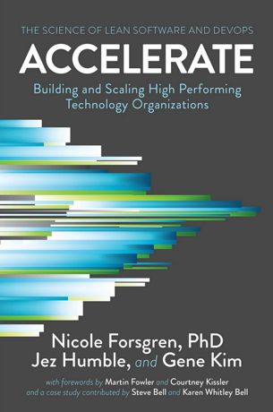
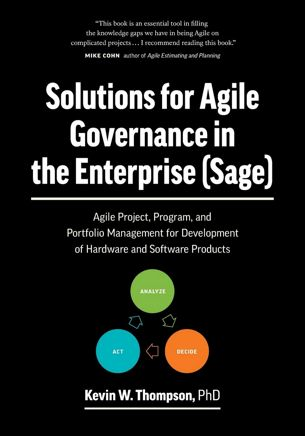

Micro book reviews from my reading list...

{:.center}

**Accelerate** — *Nicole Forsgren, PhD, Jez Humble & Gene Kim* — A hugely important and influential book. Should be required reading for any manager working in dev, product, agile, devops etc. It's no surprise this was the book of the year in 2018... Humble & Kim are practically the Godfather's of DevOps. In this book they partner with Nicole Forsgren, PhD to prove that the mindset, behaviours and practices of DevOps produce real business results.

{:.center}

**Solutions for Agile Governance in the Enterprise (SAGE)** — *Kevin W Thompson, PhD* — Is your Agile Transformation going sideways? Are your Agile Coaches shrug their shoulders and say "We told you Agile was hard, here's your invoice"? If so, grab a copy of this excellent book from Kevin Thompson, PhD. He's the principal consultant at CPrime and in this book he offers loads of practical advice to make Agile work in the Enterprise.
