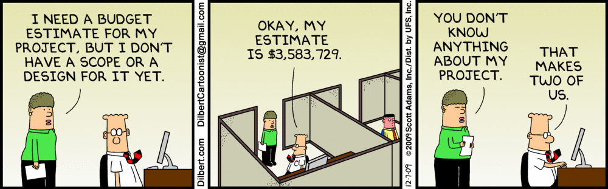
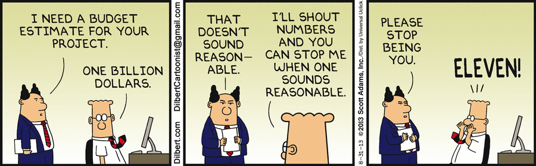
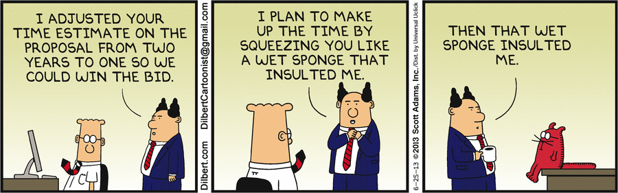
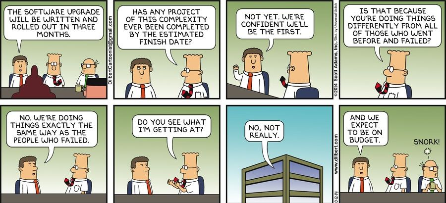

We need to stop using estimation as a legitimate approach to planning.

Unless you work in an ultra stable environment in which very little ever changes, then using estimation to plan a complex initiative will only hurt, not help.

Why?

Because the estimates are based on a point in time at which you know the very least and the estimate aka "prediction" is almost sure to be wrong. In some cases, very wrong. Not to mention that the backlog will almost certainly change several times making all the estimation pointless.

Estimates also have a funny way of rather conveniently being nipped and tucked to align with quarterly business plans and budgets rather than aligning to actual reality. And all those massive assumptions, risks and dependencies are noted and shoved down into the appendix of the proposal doc.

The original estimates are further diluted to lower cost and reduce timeline and then, bickety bam, the projects are locked and loaded, and **those unrealistic estimates becomes the official plan**. Ooof!

What happens next is a vicious and harmful cycle in which expectation collides violently with reality.

If you stand back and look at the big picture, you'll see that customer retention, net promoter score, brand sentiment, profitability, cash flow, employee engagement and employee attraction and retention will all take successive hits.

If this all sounds like a Dilbert cartoon, well...

I'll write a follow up post shortly to unpack alternative approaches to planning using a value based approach.
